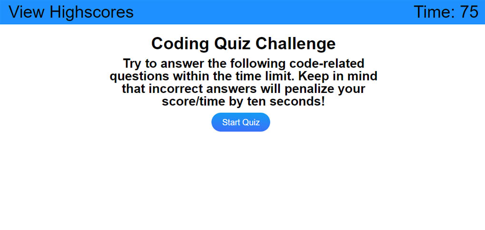

# Quiz Game OSU Bootcamp challenge 4

## Description

This project challenged me to use javascript to create html elements.

During this project I learned how to:

- work with timers.
- create html elements with Javascript and assign id or classes to them.
- use the event parameter on functions.
- add eventlisteners to html elements and buttons.
- Change styling of elements with javasript
- use localStorage to save data from user input.
- use stringify and parse with json objects.
- declare an object and save to local storage.

## Link to website

https://woestyn101.github.io/mod4Quiz/

## Installation (N/A)

## Usage

The code can be used to review how html pages can be created
width Javascript and enable the user to interact with the page content.

## Screenshot of website

## Credits: Resources used

I used and modified code from the following resources:

https://stackoverflow.com/questions/9422974/createelement-with-id

https://stackoverflow.com/questions/48493102/javascript-load-an-html-page-with-button-click

https://stackoverflow.com/questions/4810927/how-to-go-up-a-level-in-the-src-path-of-a-url-in-html

https://stackoverflow.com/questions/5656392/how-to-create-input-type-text-dynamically

https://stackoverflow.com/questions/796087/make-a-div-into-a-link

https://developer.mozilla.org/en-US/docs/Web/API/Element/mouseover_event

https://stackoverflow.com/questions/19364836/how-to-center-ordered-list-number-in-html

https://www.youtube.com/watch?v=DFhmNLKwwGw

https://www.youtube.com/watch?v=jfOv18lCMmw

https://www.w3schools.com/jsref/tryit.asp?filename=tryjsref_storage_removeitem

https://www.w3schools.com/quiztest/quiztest.asp?qtest=JS

## License

MIT
